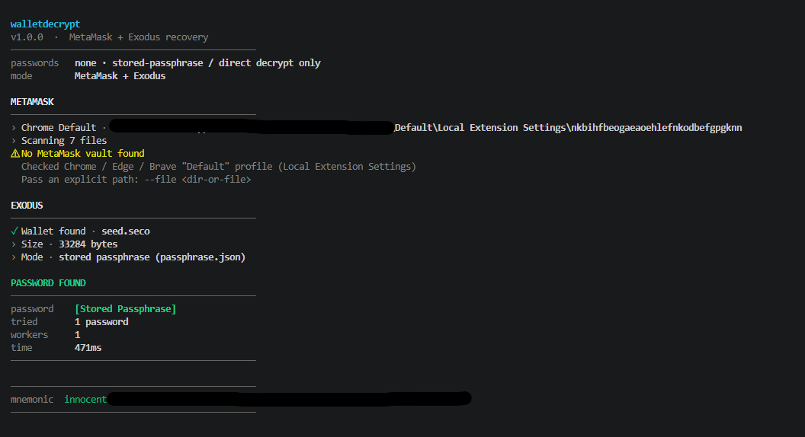

# 🔓 walletdecrypt

<div align="center">

**The all-in-one wallet recovery suite for MetaMask & Exodus**

One tool · One password list · Three modes · 100% offline

<br/>

<!-- ═══════════════════════════════════════════════ -->
<!--   SHOWCASE IMAGE — replace src below if needed  -->
<!-- ═══════════════════════════════════════════════ -->
<div align="center">
  
</div>

<br/>
<br/>


</div>

---

## 📖 Overview

**walletdecrypt** is a unified password recovery and decryption tool for the two
most popular crypto wallets — **MetaMask** and **Exodus**. Forgot your password?
Locked out of your vault? This tool scans your machine for the encrypted wallet
storage, then attempts to recover your **Secret Recovery Phrase (mnemonic)**
using a password list, a stored passphrase, or a direct decrypt attempt.


> [!IMPORTANT]
> This tool exists to help you recover **your own** wallets.
> locally, never touches the network, and never sends your data anywhere.
> Never share your recovery phrase with anyone.


## ✨ Features

-  **Three modes** — MetaMask only, Exodus only, or both in one run
-  **One shared password list** — a single `passwords.txt` drives both wallets
-  **Never stops** — no list? It still attempts stored-passphrase and direct decrypt
-  **Worker-thread cracking** — MetaMask lists run in parallel on `cores − 1` threads (auto, cap 32), with early-stop the moment a password matches
-  **Auto-detection** — finds MetaMask vaults in Chrome / Edge / Brave profiles and Exodus' `seed.seco` across Windows, macOS and Linux
-  **All vault formats** — extractors ported from the official MetaMask vault-decryptor (LevelDB `.log`, `.ldb`, raw JSON, legacy pre-v3 cleartext seeds)
-  **Native crypto** — PBKDF2-SHA256 + AES-256-GCM via Node's built-in crypto; no false positives thanks to GCM authentication
-  **Clean terminal UI** — live progress bar, colored output, human-readable results
-  **Zero network** — everything happens on your machine

## 🚀 Installation

###  Quick setup (recommended)

**1.** Clone the repository:

```bash
git clone https://github.com/zephyrcore/crypto-wallet-decryptor.git
```

**2.** Enter the project folder:

```bash
cd crypto-wallet-decryptor
```

**3.** Run the one-click setup — it verifies Node.js, installs dependencies and tells you when you're ready to go:

```bash
.\setup.bat
```


### 🔧 Manual setup

Prefer to do it yourself? Two commands:

**1.** Clone and enter the repo:

```bash
git clone https://github.com/zephyrcore/crypto-wallet-decryptor.git
cd crypto-wallet-decryptor
```

**2.** Install dependencies:

```bash
npm install
```

**3.** Start the tool:

```bash
npm run start
```

> [!NOTE]
> Requires **Node.js 20 or newer**. Grab it from [nodejs.org](https://nodejs.org/) if you don't have it.

## 🕹️ Usage

```bash
npm run start 
```

| Mode | Flag | What it does |
|------|------|--------------|
| MetaMask | `-m`, `--metamask` | Locates the browser vault, cracks it on a worker pool |
| Exodus | `-e`, `--exodus` | Locates `seed.seco`, tries passwords and extracts the mnemonic |
| Both | `-b`, `--both` | Runs MetaMask, then Exodus — **default** |

Or via npm scripts:

```bash
npm start
```

```bash
npm run metamask
```

```bash
npm run exodus
```

```bash
npm run both
```

### Options

| Flag | Meaning |
|------|---------|
| `-P`, `--passwords <file>` | Password list (default `./passwords.txt`, **optional**) |
| `-f`, `--file <path>` | Vault path — MetaMask LevelDB dir / `.log` / `.ldb` / `vault.json`, or Exodus `seed.seco` / wallet dir |
| `-w`, `--workers <n>` | MetaMask worker threads (default: auto) |
| `-h`, `--help` | Help |
| `-V`, `--version` | Version |

### Examples

Recover from both wallets with the shared `passwords.txt`:

```bash
node src/cli.js
```

Target only MetaMask with an explicit vault directory:

```bash
node src/cli.js -m -f "C:\Users\you\AppData\Local\Google\Chrome\User Data\Default\Local Extension Settings\nkbihfbeogaeaoehlefnkodbefgpgknn"
```

Target only Exodus with a specific `seed.seco`:

```bash
node src/cli.js -e -f "C:\Users\you\AppData\Roaming\Exodus\exodus.wallet\seed.seco"
```

Use a custom password list with 8 workers:

```bash
node src/cli.js -P mylist.txt -w 8
```

### The password list

One file for both wallets — `passwords.txt` in the project root:

```text
# comments and blank lines are ignored
password1
correct horse battery staple
```

Duplicates are removed automatically, and the tool **never stops** when the
list is missing or empty — it falls back to stored passphrase / direct decrypt.

## 📂 Project layout

```
walletdecrypt/
├── setup.bat            one-click installer (Windows)
├── passwords.txt        the single shared password list
├── package.json
└── src/
    ├── cli.js           CLI entry — three modes
    ├── ui.js            clean terminal UI (banner, progress, results)
    ├── passwords.js     loads + dedupes the password list
    ├── index.js         public API
    ├── metamask/        vault extraction, native decrypt, worker pool
    └── exodus/          seed.seco locate, SECO decrypt, mnemonic extraction
```

## 📚 Library API

Use it from your own code:

```js
import { loadPasswords, runMetaMask, runExodus } from './src/index.js'

const { passwords } = loadPasswords()
await runMetaMask(passwords)
await runExodus(passwords)
```

## ❓ FAQ

**Is this legal / ethical?**
Yes — this is a recovery tool for your own wallets, built on officially
published open-source code from MetaMask itself. Decrypting storage that is
on *your* machine with *your* own tooling is exactly what MetaMask's
[vault-decryptor](https://github.com/MetaMask/vault-decryptor) was made for.

**Can it crack any wallet?**
No. If the password isn't in your list and no stored passphrase exists, it
will not magically find it — wallet encryption is strong. This recovers
passwords you *might have used*, stored in your list.

**Does it send my data anywhere?**
Never. There is no network code at all. Everything is local.

**Where does it look for wallets by default?**

| Wallet | Location |
|--------|----------|
| MetaMask | Chrome / Edge / Brave `Default` profile → `Local Extension Settings/nkbihfbeogaeaoehlefnkodbefgpgknn` |
| Exodus | `%APPDATA%\Exodus\exodus.wallet` (Windows) · `~/Library/Application Support/Exodus/exodus.wallet` (macOS) · `~/.config/Exodus/exodus.wallet` (Linux) |

## 🛡️ Security notes

- Runs **locally only** — the codebase contains zero network calls
- AES-GCM / SECO authentication makes false positives impossible: a reported
  password is always the real one
- Treat your recovery phrase like cash — anyone who has it owns your wallet

---

<div align="center">

**If you recover a wallet you thought was lost forever — that just made your day.** ⭐

</div>
